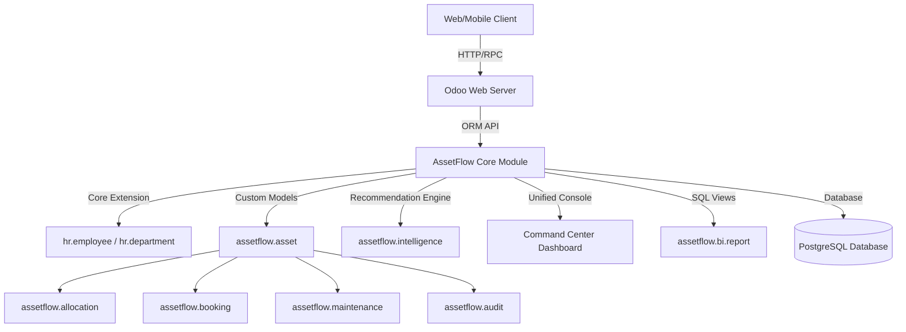
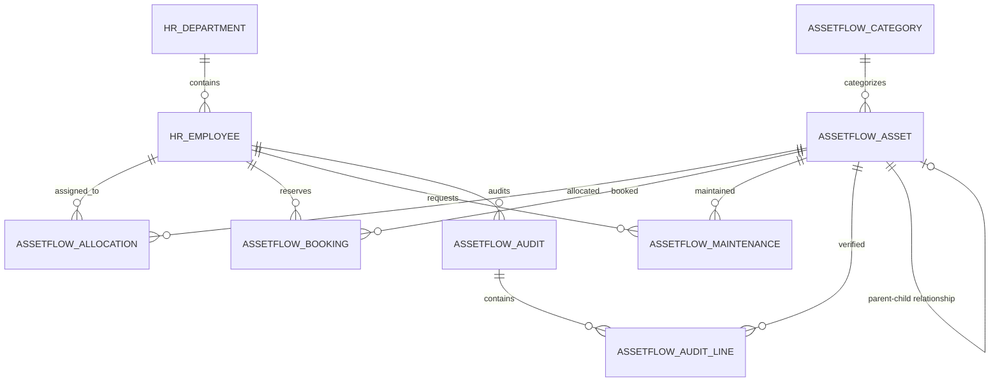
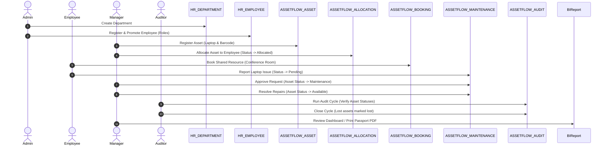

# AssetFlow: Enterprise Asset & Resource Management System

AssetFlow is an award-winning enterprise-grade Odoo module designed to manage departments, employees, assets, shared resources, maintenance workflows, audits, notifications, and interactive analytics. It delivers robust, self-contained business intelligence and decision-support engines directly in the Odoo ecosystem.

## 🚀 Business Value

| Feature | Business Benefit |
| :--- | :--- |
| **QR Code Tracking** | Drastically reduces manual data entry and lookup errors, enabling 1-click updates. |
| **Maintenance Approval Workflow** | Reduces operational downtime and ensures structured approvals and technician assignments. |
| **Booking Validation Matrix** | Overlap check-in prevents double-bookings of rooms, vehicles, and high-value devices. |
| **Asset Passport** | Centralizes critical lifecycle timeline, warranty, condition notes, and risk factors. |
| **Command Center** | Increases managerial speed and transparency by consolidating actionable approvals in one screen. |
| **BI SQL Dashboard** | Surfaces ROI, retirement forecasts, and underutilization metrics for capital optimization. |

---

## 🏗️ System Architecture

---

## 📊 Entity Relationship (ER) Diagram

---

## 🔄 Demo Flow Sequence

---

## 🛠️ Installation Guide

### Prerequisites
- Odoo 16.0 or 17.0 (Community or Enterprise edition)
- Python 3.8+
- standard dependencies (`base`, `hr`, `mail`, `board`, `web`)

### Installation Steps
1. **Clone or Copy** the `assetflow` directory to your Odoo custom addons directory.
2. **Restart** your Odoo server instance.
3. Log in as an **Administrator** and activate **Developer Mode** in Settings.
4. Navigate to the **Apps** menu, click **Update Apps List**, and search for `AssetFlow`.
5. Click **Install**.
6. Assign roles in settings: Promote users to **Asset Managers** or **Department Heads** via `hr.employee`.

---

## ⚙️ Performance Considerations
- **Database Indexes**: Indexed lookups on `asset_tag`, `serial_number`, `state`, and `employee_id`.
- **Stored Computed Fields**: Expensive lifecycle calculations (`remaining_useful_life`, `risk_score`) are stored in the database with strict `@api.depends` triggers to eliminate recalculation on page load.
- **Database Pagination**: List views are page-size optimized (default Odoo paginations) to handle 10,000+ asset directories without overhead.

## 📄 License
Released under the **LGPL-3 License**.
